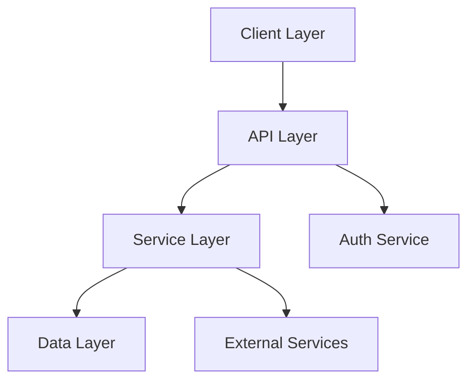
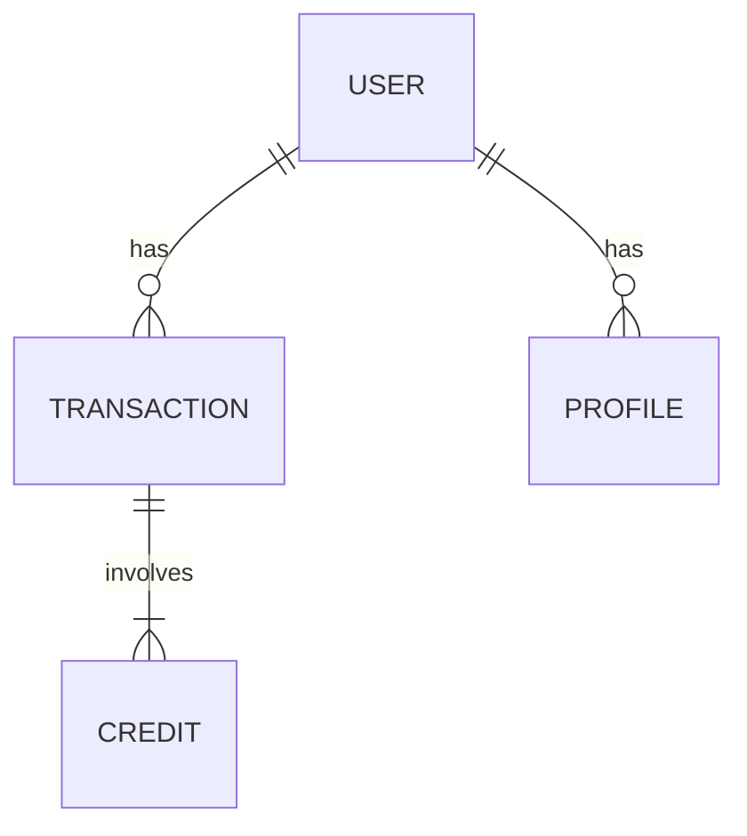
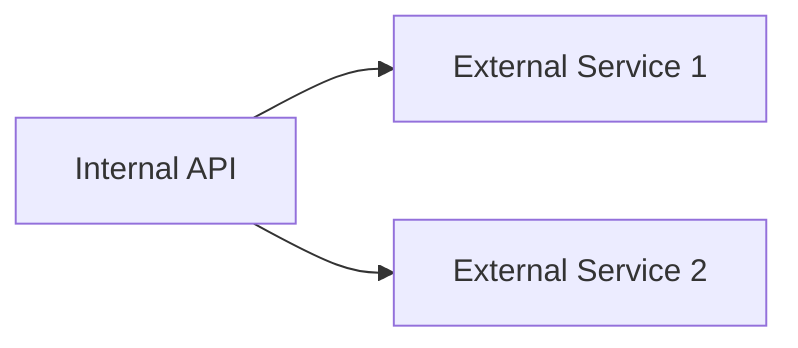
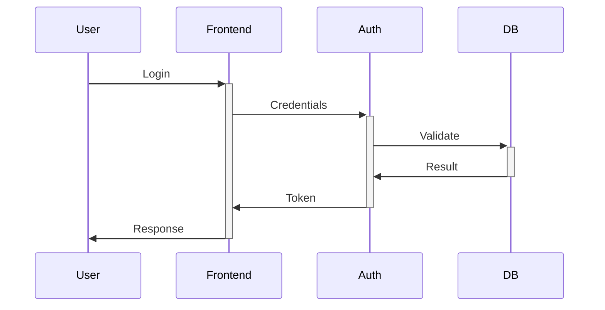
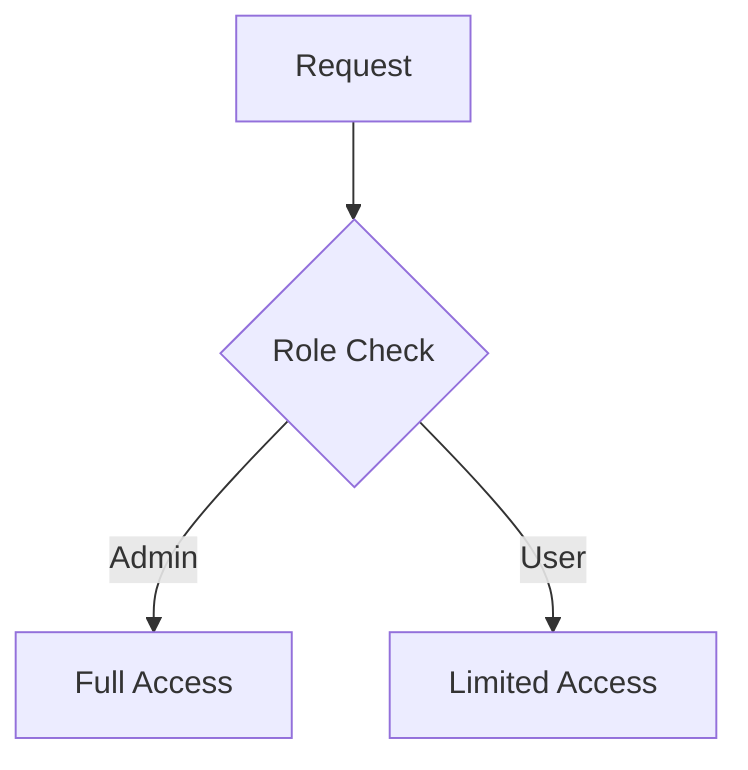
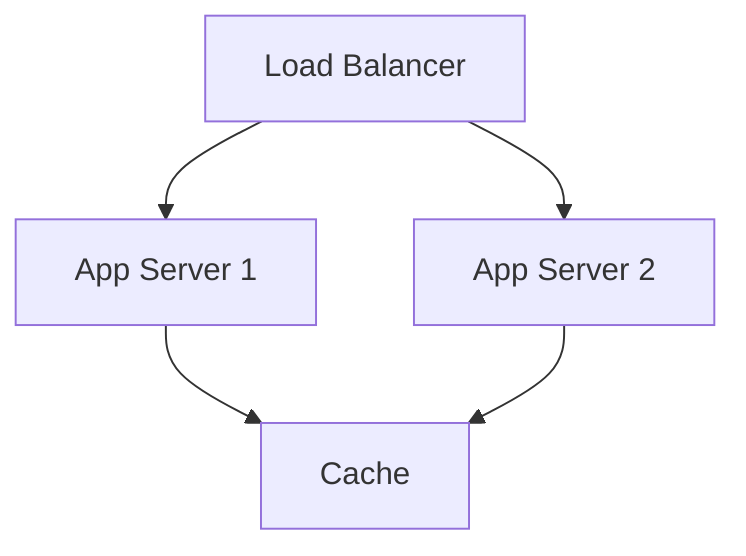
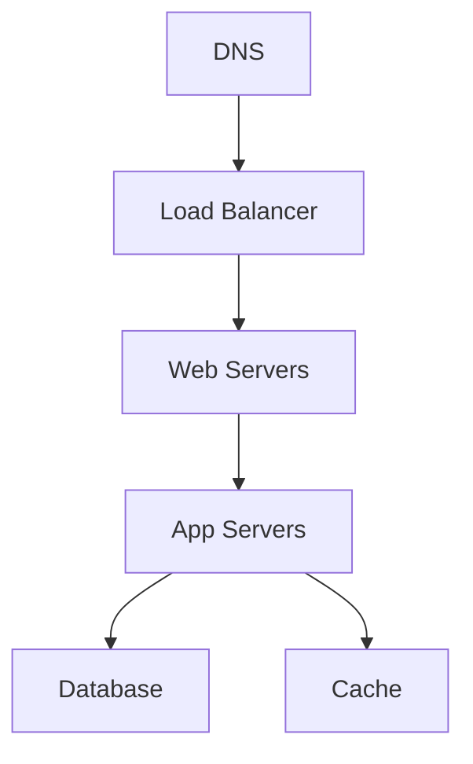
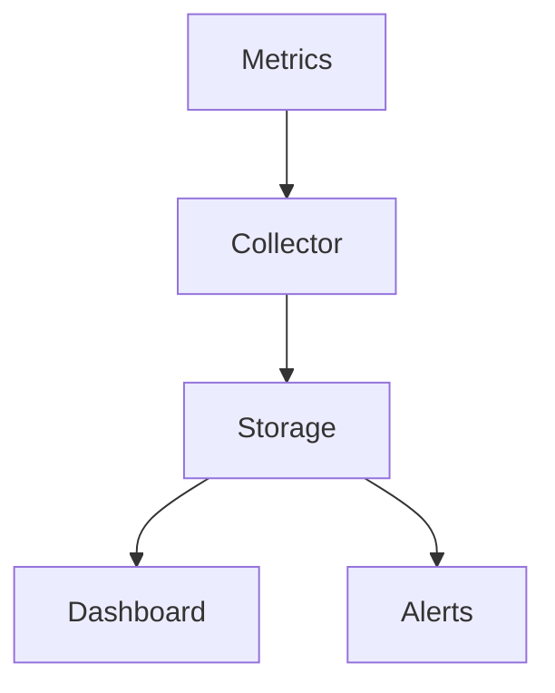
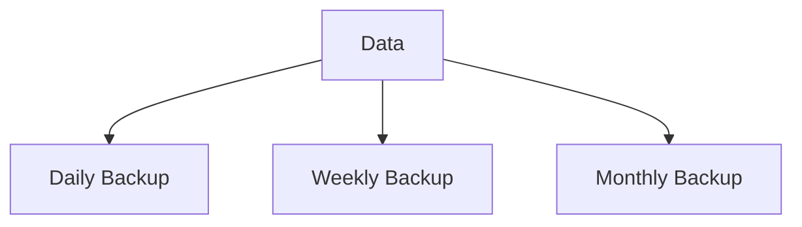

# Technical Architecture

## Overview
This document outlines the technical architecture of [Project Name], including system components, data flows, security architecture, and implementation details. Each section includes rationale for architectural decisions and relevant diagrams.

## System Architecture

### Purpose
Provides a high-level view of the system's components and their interactions, helping developers understand the overall structure and flow.

### Component Diagram


### Components
1. Client Layer
   - Purpose: [Describe purpose]
   - Implementation: [Implementation details]
   - Technologies: [List technologies]
   - Rationale: [Explain choices]

2. API Layer
   - Purpose: [Describe purpose]
   - Implementation: [Implementation details]
   - Technologies: [List technologies]
   - Rationale: [Explain choices]

3. Service Layer
   [Same structure as above]

4. Data Layer
   [Same structure as above]

## Data Architecture

### Purpose
Documents the data model, relationships, and flow of data through the system.

### Data Model


### Database Design
- Schema Design:
  ```sql
  CREATE TABLE example (
    id INT PRIMARY KEY,
    ...
  );
  ```
- Relationships: [Document relationships]
- Indexes: [List indexes and rationale]
- Partitioning: [Describe strategy]

### Data Flow


- Input Validation: [Describe approach]
- Processing Steps: [List steps]
- Storage Strategy: [Describe strategy]
- Caching Approach: [Detail caching]

## API Architecture

### Purpose
Defines the API design principles, authentication, and integration points.

### API Design
- REST/GraphQL Decisions:
  ```
  Rationale for choosing REST:
  1. [Reason]
  2. [Reason]
  ```
- Authentication Flow:
  ```mermaid
  sequenceDiagram
    Client->>Auth: Login Request
    Auth->>DB: Validate
    DB->>Auth: Result
    Auth->>Client: Token
  ```
- Rate Limiting: [Describe strategy]
- Versioning: [Describe approach]

### Integration Points


- External Services: [List services]
- Third-party APIs: [List APIs]
- Webhooks: [Document webhooks]
- Event Streams: [Describe streams]

## Security Architecture

### Purpose
Documents the security measures and controls implemented throughout the system.

### Authentication Flow


### Authorization Model


### Data Protection


## Performance Architecture

### Purpose
Defines the strategies and implementations for ensuring system performance and scalability.

### Scalability


### Optimization
- Caching Strategy:
  ```mermaid
  graph LR
    A[Request] --> B{Cache?}
    B -->|Hit| C[Return Cached]
    B -->|Miss| D[Compute]
    D --> E[Cache]
    E --> F[Return]
  ```
- Database Optimization: [Detail strategies]
- Asset Optimization: [Describe approach]
- Code Optimization: [List techniques]

## Deployment Architecture

### Purpose
Documents the deployment process and infrastructure setup.

### Infrastructure Diagram


### Environments
- Development:
  ```mermaid
  graph LR
    A[Dev] --> B[Test]
    B --> C[Staging]
    C --> D[Production]
  ```
- Testing: [Describe environment]
- Staging: [Describe environment]
- Production: [Describe environment]

## Monitoring Architecture

### Purpose
Defines the approach to system monitoring, logging, and alerting.

### Monitoring Flow


### Components
- Metrics Collection: [Describe approach]
- Log Aggregation: [Detail strategy]
- Alert System: [Define rules]
- Dashboards: [List views]

## Disaster Recovery

### Purpose
Documents the strategies and procedures for system recovery and business continuity.

### Backup Strategy


### Recovery Procedures
- Data Recovery: [Detail steps]
- System Recovery: [Detail steps]
- Failover Process: [Describe process]

## Implementation Notes
- Each component should include rationale for architectural decisions
- Diagrams should be updated when architecture changes
- Performance implications should be documented
- Security considerations should be highlighted

<!-- LLM Instructions
When updating this template:
1. Include clear rationale for architectural decisions
2. Add relevant diagrams for each section
3. Update component relationships
4. Document security implications
5. Include performance considerations
6. Add implementation examples
-->