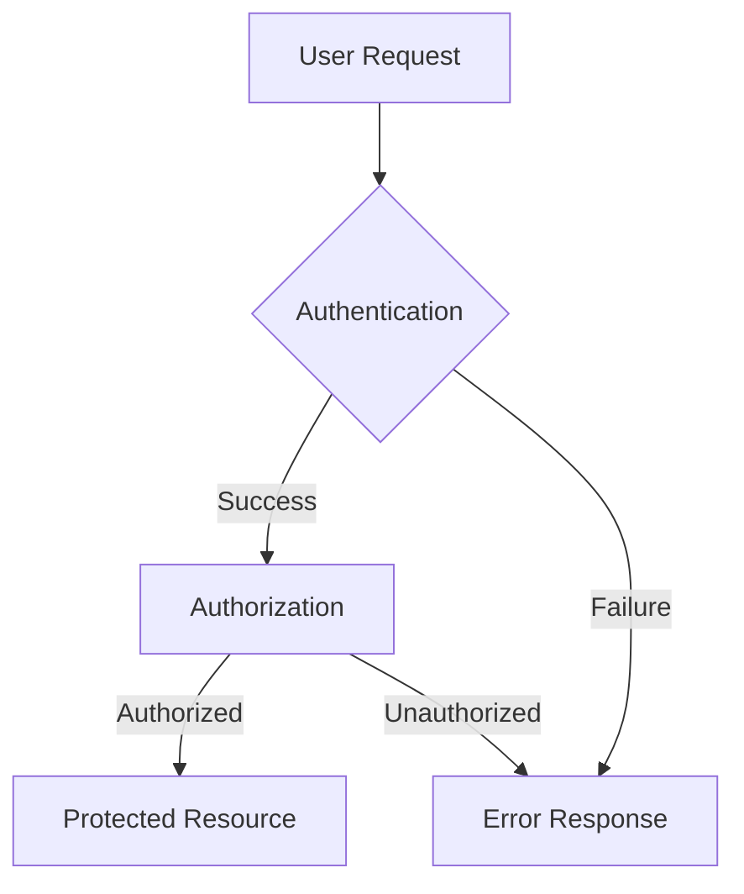
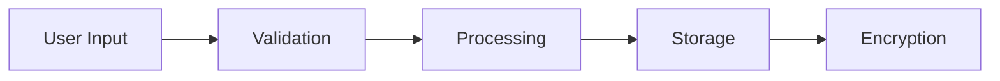
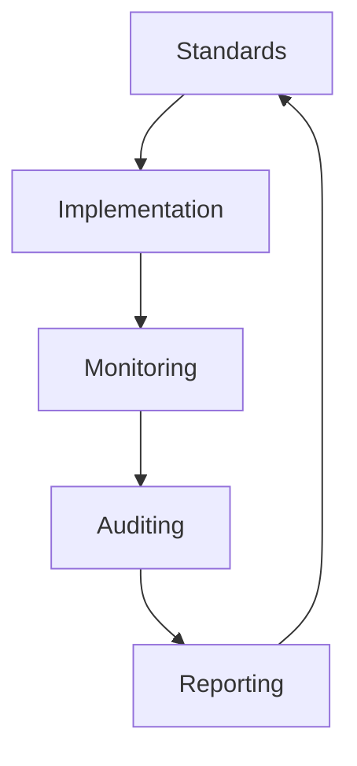

# Governance Documentation

## Overview
This document outlines the governance model for [Project Name], including security measures, privacy controls, sustainability practices, and licensing information. Each section provides detailed implementation guidelines and rationale.

## Security

### Security Policy
Outline the security principles and practices:
- Security model (e.g., Zero-trust, Defense-in-depth)
- Risk management approach
- Incident response procedures
- Security review process

Implementation:
```
[Describe how these principles are implemented in the codebase]
```

### Authentication & Authorization
Detail the authentication and authorization mechanisms:
- Authentication methods
- Authorization levels
- Session management
- Token handling

Implementation:
```
[Provide code examples or configuration details]
```

### Data Security
Explain data protection measures:
- Encryption standards
- Data classification levels
- Access control implementation
- Audit logging practices

Implementation:
```
[Detail the technical implementation of data security measures]
```

### Infrastructure Security
Document infrastructure protection:
- Network security measures
- Container security
- Cloud security controls
- Monitoring systems

Implementation:
```
[Describe infrastructure security configurations]
```

## Privacy

### Data Protection
Detail data handling practices:
- Personal data processing
- Data minimization strategies
- Retention policies
- Deletion procedures

Implementation:
```
[Explain how data protection is implemented]
```

### Privacy Policy
Document privacy requirements:
- Data collection scope
- Usage limitations
- User consent management
- Data access rights

Implementation:
```
[Detail how privacy policies are enforced in the code]
```

### Compliance
List compliance requirements:
- Regulatory standards (GDPR, CCPA, etc.)
- Industry certifications
- Audit procedures
- Compliance monitoring

Implementation:
```
[Describe compliance implementation details]
```

### Data Processing
Explain data flow:
- Processing procedures
- Third-party processors
- International transfers
- Data agreements

Implementation:
```
[Detail data processing implementations]
```

## Sustainability

### Environmental Impact
Document environmental considerations:
- Energy efficiency measures
- Resource optimization
- Carbon footprint tracking
- Green initiatives

Implementation:
```
[Describe sustainability implementations]
```

### Code Sustainability
Detail code maintenance practices:
- Technical debt management
- Code maintainability standards
- Scalability considerations
- Documentation requirements

Implementation:
```
[Explain code sustainability practices]
```

### Resource Management
Outline resource optimization:
- Infrastructure efficiency
- Cost optimization
- Resource monitoring
- Capacity planning

Implementation:
```
[Detail resource management implementations]
```

## Licensing

### Software License
[Project Name] is licensed under the [License Name] license.

Full license text:
```
[Include complete license text]
```

### Third-Party Licenses
Document third-party components:
| Component | License | Usage | Compliance Requirements |
|-----------|---------|--------|------------------------|
| [Name]    | [Type]  | [Use]  | [Requirements]        |

### Intellectual Property
Detail IP rights:
- Copyright notices
- Trademark usage
- Patent claims
- Trade secrets protection

Implementation:
```
[Describe IP protection measures]
```

## Compliance

### Standards Compliance
List applicable standards:
- Technical standards
- Security standards
- Privacy standards
- Industry standards

Implementation:
```
[Detail standards compliance measures]
```

### Audit Procedures
Document audit processes:
- Internal audit schedule
- External audit requirements
- Compliance checks
- Documentation requirements

Implementation:
```
[Describe audit implementation]
```

### Reporting
Detail reporting requirements:
- Compliance reporting
- Audit reporting
- Incident reporting
- Performance reporting

Implementation:
```
[Explain reporting procedures]
```

## Review & Updates

### Regular Reviews
Document review processes:
- Policy review schedule
- Security review procedures
- Privacy review requirements
- Compliance review process

Implementation:
```
[Detail review procedures]
```

### Update Procedures
Outline update processes:
- Policy update procedures
- Documentation updates
- Communication plans
- Training updates

Implementation:
```
[Describe update procedures]
```

## Diagrams

### Security Architecture


### Data Flow


### Compliance Framework


## Implementation Notes
- Each section should include specific implementation details
- Code examples should be provided where relevant
- Diagrams should be updated to reflect current architecture
- Regular reviews should be documented with dates and outcomes

<!-- LLM Instructions
When updating this template:
1. Include specific implementation details for each section
2. Add relevant code examples
3. Update diagrams to match actual architecture
4. Ensure compliance requirements are current
5. Add security measures for new features
6. Document privacy implications
-->